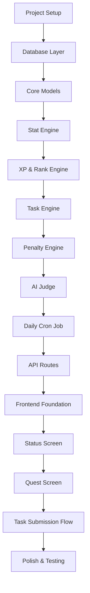

# RL-SLS Implementation Checklist

## High-Level Flow

## Phase 1: Foundation (Backend)

### Step 1.1: Project Structure & Dependencies

- [ ] Initialize monorepo/workspace structure
- [ ] Setup backend folder (`server/`)
- [ ] Setup frontend folder (`client/` or `app/`)
- [ ] Install core dependencies (Express, Sequelize, TypeScript, etc.)
- [ ] Configure TypeScript configs (backend + frontend)
- [ ] Setup environment variables structure (`.env.example`)
- [ ] Configure ESLint/Prettier

### Step 1.2: Database Connection

- [ ] Create Sequelize instance and config
- [ ] Setup PostgreSQL connection
- [ ] Test database connectivity
- [ ] Create migration system setup

### Step 1.3: Core Models (Sequelize)

- [ ] `Player` model (id, rank, level, totalXp, createdAt)
- [ ] `Stats` model (playerId, physical, intelligence, discipline, charisma, confidence, creativity)
- [ ] `Task` model (id, type, difficulty, description, targetStat, xpReward, deadline)
- [ ] `TaskLog` model (taskId, playerId, status, evidence, aiVerdict, createdAt)
- [ ] Setup model associations (Player 1:1 Stats, Player 1:Many TaskLog, Task 1:Many TaskLog)
- [ ] Create initial migration
- [ ] Test model creation and relationships

## Phase 2: Core Engines (Backend Services)

### Step 2.1: Stat Engine Service

- [ ] Create `stat.service.ts`
- [ ] Implement `applyStatChange(playerId, changes)` with clamping (0-100)
- [ ] Implement `applyDailyDecay(playerId)` with decay rates from Draft2
- [ ] Add stat mutation logging
- [ ] Unit tests for stat calculations

### Step 2.2: XP & Rank Engine Service

- [ ] Create `xp.service.ts`
- [ ] Implement `addXp(playerId, amount)` - updates totalXp
- [ ] Implement `recalculateLevel(player)` - uses formula: `100 * level^1.5`
- [ ] Implement `recalculateRank(player)` - XP thresholds from Draft2
- [ ] Ensure rank is derived, never manually set
- [ ] Unit tests for XP/level/rank math

### Step 2.3: Task Engine Service

- [ ] Create `task.service.ts`
- [ ] Implement `generateDailyTask(player)` - basic deterministic version first
- [ ] Implement `submitTask(taskId, evidence)` - creates TaskLog
- [ ] Implement `resolveTask(taskLog, aiResult)` - applies XP and stats
- [ ] Basic task generation logic (weakest stat bias)

### Step 2.4: Penalty Engine Service

- [ ] Create `penalty.service.ts`
- [ ] Implement `applyMissPenalty(player)` - stat decay on missed tasks
- [ ] Implement `lockRankIfNeeded(player)` - PSI calculation from Draft2
- [ ] Penalty severity logic

## Phase 3: AI Integration (Backend)

### Step 3.1: AI Judge Module

- [ ] Create `ai/judge.ts`
- [ ] Setup OpenAI client configuration
- [ ] Create strict Judge prompt (from Draft3)
- [ ] Implement `judgeTask(task, playerStats, evidence)` function
- [ ] JSON response validation and parsing
- [ ] Error handling for AI failures (fallback to deterministic rules)
- [ ] Test with sample evidence

### Step 3.2: AI Integration with Task Engine

- [ ] Connect AI Judge to task submission flow
- [ ] Validate AI output before applying to DB
- [ ] Ensure AI never directly mutates DB (Rule Engine → AI → Stat Engine → DB)

## Phase 4: Automation (Backend Jobs)

### Step 4.1: Daily Cron Job

- [ ] Create `jobs/dailyDecay.job.ts`
- [ ] Setup cron scheduler (node-cron)
- [ ] Implement daily flow:
  - Fetch player
  - Apply stat decay
  - Check missed tasks
  - Apply penalties
  - Generate new daily quest
- [ ] Test job execution manually
- [ ] Add logging for job runs

## Phase 5: API Layer (Backend Routes)

### Step 5.1: Express App Setup

- [ ] Create `app.ts` with Express
- [ ] Setup middleware (CORS, JSON parsing, error handling)
- [ ] Create route structure

### Step 5.2: Player Routes

- [ ] `GET /api/player/status` - returns player, stats, rank, level
- [ ] Controller calls `player.service.ts` (no business logic in route)

### Step 5.3: Task Routes

- [ ] `GET /api/tasks/current` - returns active daily quest
- [ ] `POST /api/tasks/:id/submit` - submits evidence, triggers AI Judge, applies results
- [ ] `GET /api/tasks/history` - returns task logs

### Step 5.4: AI Routes (if needed for testing)

- [ ] `POST /api/ai/judge` - manual testing endpoint (optional)

## Phase 6: Frontend Foundation

### Step 6.1: Next.js Setup

- [ ] Initialize Next.js with App Router
- [ ] Configure TypeScript
- [ ] Setup Tailwind CSS
- [ ] Enforce mobile-only viewport (max-width: 430px)
- [ ] Create base layout with dark theme

### Step 6.2: API Client

- [ ] Create API client utilities
- [ ] Setup environment variables for API URL
- [ ] Error handling for API calls

## Phase 7: Frontend Screens

### Step 7.1: Status Screen

- [ ] Create `/app/page.tsx` (Status page)
- [ ] Display rank badge (E-SS)
- [ ] Display level and XP progress bar
- [ ] Display stat bars (6 stats, 0-100)
- [ ] Fetch player data from API
- [ ] Basic styling (dark, minimal, game-like)

### Step 7.2: Quest Screen

- [ ] Create `/app/quests/page.tsx`
- [ ] Display current daily quest
- [ ] Accept/Reject buttons
- [ ] Submit evidence form (text input for V1)
- [ ] Show task difficulty and XP reward
- [ ] Connect to task submission API

### Step 7.3: Navigation

- [ ] Bottom navigation bar (Status, Quests, Logs)
- [ ] Mobile-optimized navigation

### Step 7.4: Logs Screen

- [ ] Create `/app/logs/page.tsx`
- [ ] Display task history (TaskLog entries)
- [ ] Show success/failure status
- [ ] Show AI verdict comments

## Phase 8: Integration & Polish

### Step 8.1: End-to-End Flow Testing

- [ ] Test complete task flow: Generate → Accept → Submit → Judge → Apply
- [ ] Test stat decay on missed tasks
- [ ] Test penalty application
- [ ] Test rank progression

### Step 8.2: Error Handling

- [ ] Frontend error states
- [ ] Backend error responses
- [ ] AI failure fallbacks

### Step 8.3: UI Polish

- [ ] Dark theme refinement
- [ ] Stat bar animations (optional)
- [ ] Loading states
- [ ] Success/failure feedback

## Notes

- Each step should be completed and tested before moving to the next
- Backend services are independent and can be tested in isolation
- AI integration is the last backend piece before API routes
- Frontend is built after backend API is functional
- Daily cron job can be tested manually before scheduling